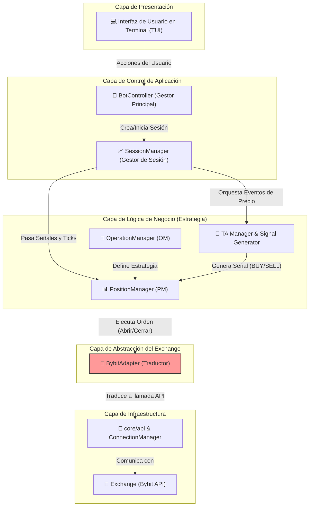

# Python Trading Bot - Arquitectura de Software Avanzada

![GIF de la TUI en acción] <!-- ¡IMPORTANTE! Graba un GIF de tu bot funcionando y ponlo aquí. Es lo más impactante. -->

Un bot de trading algorítmico para Bybit construido en Python, enfocado en una **arquitectura modular, escalable y robusta**. Este proyecto es una demostración práctica de principios de diseño de software como la Inyección de Dependencias, el Patrón Adaptador y la Separación de Responsabilidades, todo controlado a través de una completa Interfaz de Usuario en Terminal (TUI).

> ### **Advertencia de Seguridad y Riesgo**
> **EL TRADING DE FUTUROS CON APALANCAMIENTO ES EXTREMADAMENTE RIESGOSO Y PUEDE RESULTAR EN LA PÉRDIDA TOTAL DE SU CAPITAL.**
> Este software se proporciona "tal cual", sin ninguna garantía. El autor no se hace responsable de ninguna pérdida financiera. **Nunca** ejecute este bot en una cuenta real sin haberlo probado extensivamente en **TESTNET**.

---

## ✨ Características Clave

*   **Interfaz de Usuario en Terminal (TUI):** Menús interactivos construidos con `simple-term-menu` para controlar el bot en tiempo real, configurar estrategias, monitorear el rendimiento y visualizar logs.
*   **Arquitectura en Capas Limpia:** Clara separación entre la capa de Presentación (TUI), la Lógica de Negocio (Estrategia) y el Acceso a Datos (API), facilitando el mantenimiento y la escalabilidad.
*   **Gestión de Estrategia Modular:** Permite configurar y ejecutar estrategias complejas (ej. promediación de costos) con múltiples posiciones lógicas, límites de riesgo (SL/TP/TSL) y condiciones de entrada/salida personalizables.
*   **Abstracción del Exchange (Patrón Adaptador):** Diseñado con una interfaz (`AbstractExchange`) que independiza la lógica del bot del exchange. La implementación actual para Bybit (`BybitAdapter`) podría ser reemplazada o extendida para otros exchanges con un esfuerzo mínimo.
*   **Manejo de Cuentas Múltiples:** Orquesta operaciones y transferencias entre subcuentas dedicadas (main, longs, shorts, profit) para un aislamiento de riesgo y una gestión de capital superior.
*   **Configuración en Caliente ("Hot Reload"):** Permite ajustar parámetros críticos de la estrategia (indicadores de TA, configuración de riesgo) durante una sesión de trading activa, sin necesidad de reiniciar el bot.
*   **Logging Asíncrono y Detallado:** Registra señales, posiciones cerradas e instantáneas de sesión en archivos `.jsonl` para un análisis y auditoría posterior, sin bloquear el hilo principal.

## 🛠️ Stack Tecnológico y Principios de Diseño

*   **Lenguaje:** Python 3.10+
*   **Librerías Principales:** `pybit`, `pandas`, `numpy`, `simple-term-menu`, `python-dotenv`
*   **Principios de Diseño Aplicados:**
    *   **Arquitectura Limpia (Clean Architecture):** Flujo de dependencias claro hacia el núcleo del negocio.
    *   **Inyección de Dependencias (DI):** Las clases reciben sus dependencias en lugar de crearlas, lo que facilita las pruebas y la modularidad.
    *   **Patrón Fachada (Facade):** Módulos `_api.py` que exponen una interfaz simple para subsistemas complejos (PM, OM, SM).
    *   **Patrón Adaptador (Adapter):** La capa `core/exchange` que desacopla el bot de la implementación específica de Bybit.
    *   **Separación de Responsabilidades (SoC):** Cada clase y módulo tiene un propósito bien definido (ej. `PositionExecutor` solo ejecuta, `_calculator` solo calcula).

## 📐 Diagrama de Arquitectura (Simplificado)


## 🚀 Puesta en Marcha

Sigue estos pasos para configurar y ejecutar el bot en tu máquina local.

### 1. Prerrequisitos
-   Python 3.10 o superior.
-   Una cuenta en [Bybit](https://www.bybit.com/).

### 2. Instalación
1.  **Clonar el repositorio:**
    ```bash
    git clone https://github.com/zantgo/bybit-futures-bot-67.git
    cd tu-repositorio
    ```

2.  **Crear y activar un entorno virtual:**
    ```bash
    python -m venv venv
    # En Windows:
    .\venv\Scripts\activate
    # En macOS/Linux:
    source venv/bin/activate
    ```

3.  **Instalar las dependencias:**
    ```bash
    pip install -r requirements.txt
    ```

### 3. Configuración en Bybit y `.env`

El bot utiliza subcuentas para una gestión de riesgo aislada.

1.  **Crea Subcuentas en Bybit:**
    *   En tu panel de Bybit, ve a "Subcuentas" y crea tres subcuentas de tipo **"Cuenta de Trading Unificado"**. Nómbralas `longs`, `shorts`, y `profit`.
    *   Anota el **UID** de cada una de estas subcuentas.

2.  **Genera las Claves API:**
    *   **Cuenta Principal:** Crea una clave API con permisos **Leer/Escribir** para **Activos -> Transferencia**.
    *   **Subcuentas (`longs`, `shorts`, `profit`):** Para cada una, crea una clave API con permisos **Leer/Escribir** para **Contrato -> Trading Unificado**.

3.  **Configura el archivo `.env`:**
    *   Crea una copia del archivo de ejemplo: `cp .env.example .env` (o `copy .env.example .env` en Windows).
    *   Abre el archivo `.env` y rellena **todas** las variables con tus claves API y UIDs.

4.  **Deposita Fondos:**
    *   Transfiere fondos (USDT) desde tu cuenta principal a las subcuentas `longs` y `shorts` para que el bot pueda operar.

### 4. Checklist Final y Ejecución

**¡IMPORTANTE!** Antes de cada ejecución, asegúrate de que tu configuración en Bybit coincide con la del bot.

*   ✅ **Símbolo y Capital:** Confirma que el símbolo es el correcto y que hay suficiente balance en las subcuentas `longs` y `shorts`.

*   ✅ **Modo Hedge:** El bot **requiere** que el Modo Hedge esté activado para el par que vas a operar en la plataforma de Bybit.

**Para ejecutar el bot:**
```bash
python main.py
```

## 📂 Estructura del Proyecto

```
/
├── core/                # Lógica central del bot
│   ├── api/             # Comunicación de bajo nivel con el exchange
│   ├── bot_controller/  # Orquestador principal de la aplicación
│   ├── exchange/        # Capa de abstracción del exchange (Adapter)
│   ├── logging/         # Módulos de logging
│   ├── menu/            # Toda la lógica de la Interfaz de Usuario (TUI)
│   └── strategy/        # El corazón de la lógica de trading (SM, OM, PM, TA, Signal)
├── connection/          # Gestión de conexiones y el Ticker de precios
├── runner/              # Ensamblador de dependencias y lógica de apagado
├── config.py            # Archivo principal de configuración de la estrategia
├── main.py              # Punto de entrada de la aplicación
├── requirements.txt     # Dependencias del proyecto
└── .env.example         # Plantilla para las variables de entorno
```

## 📄 Licencia

Este proyecto está bajo la Licencia MIT. Ver el archivo [LICENSE](LICENSE) para más detalles.
