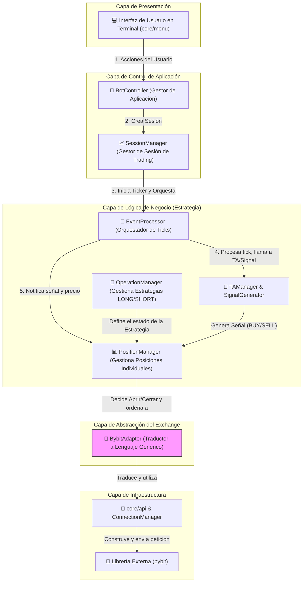
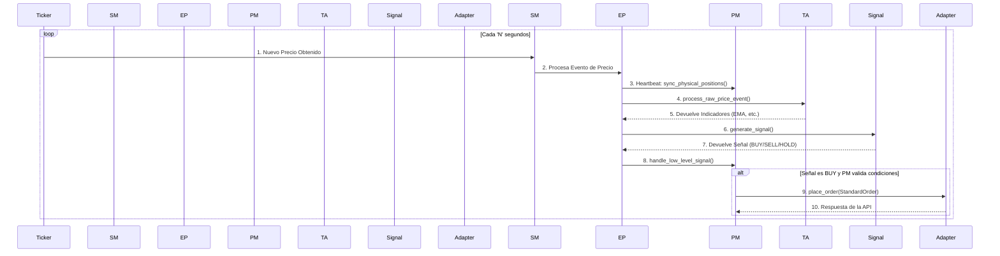
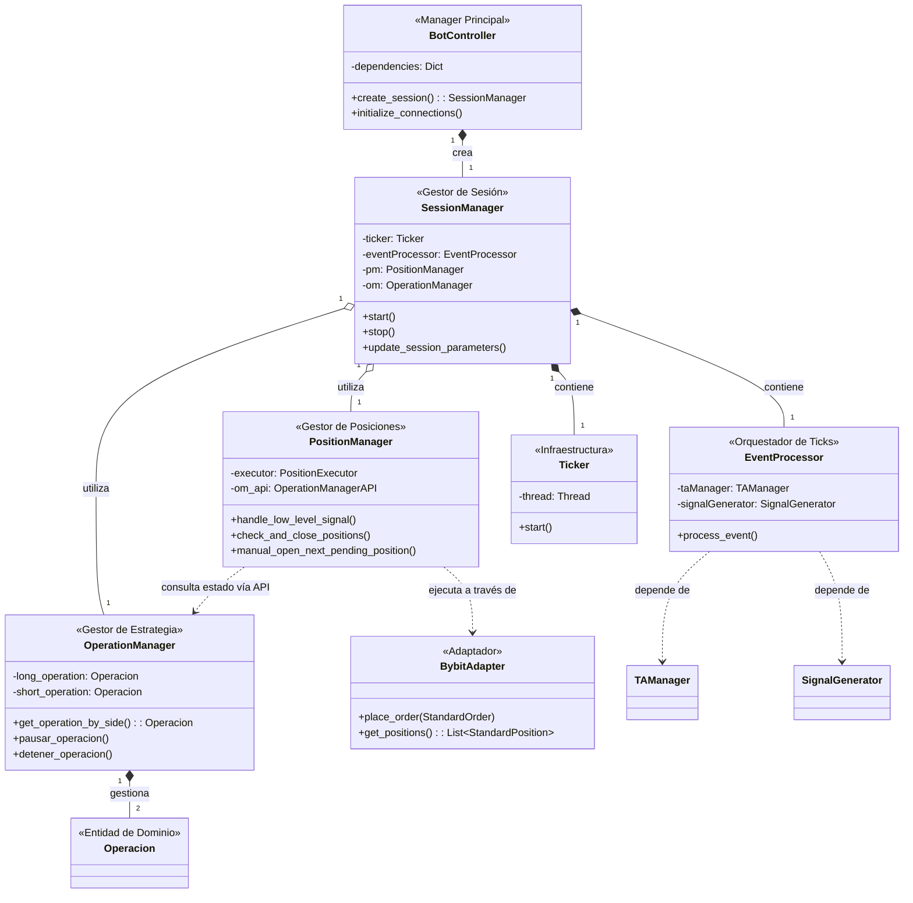

# Python Trading Bot - Arquitectura de Software Avanzada

![GIF de la TUI en acción] <!-- ¡IMPORTANTE! Graba un GIF de tu bot funcionando y ponlo aquí. Es lo más impactante. -->

Un bot de trading algorítmico para Bybit construido en Python, enfocado en una **arquitectura modular, escalable y robusta**. Este proyecto es una demostración práctica de principios de diseño de software como la Inyección de Dependencias, el Patrón Adaptador y la Separación de Responsabilidades, todo controlado a través de una completa Interfaz de Usuario en Terminal (TUI).

> ### **Advertencia de Seguridad y Riesgo**
> **EL TRADING DE FUTUROS CON APALANCAMIENTO ES EXTREMADAMENTE RIESGOSO Y PUEDE RESULTAR EN LA PÉRDIDA TOTAL DE SU CAPITAL.**
> Este software se proporciona "tal cual", sin ninguna garantía. El autor no se hace responsable de ninguna pérdida financiera. **Nunca** ejecute este bot en una cuenta real sin haberlo probado extensivamente en **TESTNET**.

---

## ✨ Características Clave

*   **Interfaz de Usuario en Terminal (TUI):** Menús interactivos construidos con `simple-term-menu` para controlar el bot en tiempo real, configurar estrategias, monitorear el rendimiento y visualizar logs.
*   **Arquitectura en Capas Limpia:** Clara separación entre la capa de Presentación (TUI), la Lógica de Negocio (Estrategia) y el Acceso a Datos (API), facilitando el mantenimiento y la escalabilidad.
*   **Gestión de Estrategia Modular:** Permite configurar y ejecutar estrategias complejas (ej. promediación de costos) con múltiples posiciones lógicas, límites de riesgo (SL/TP/TSL) y condiciones de entrada/salida personalizables.
*   **Abstracción del Exchange (Patrón Adaptador):** Diseñado con una interfaz (`AbstractExchange`) que independiza la lógica del bot del exchange. La implementación actual para Bybit (`BybitAdapter`) podría ser reemplazada o extendida para otros exchanges con un esfuerzo mínimo.
*   **Manejo de Cuentas Múltiples:** Orquesta operaciones y transferencias entre subcuentas dedicadas (main, longs, shorts, profit) para un aislamiento de riesgo y una gestión de capital superior.
*   **Configuración en Caliente ("Hot Reload"):** Permite ajustar parámetros críticos de la estrategia (indicadores de TA, configuración de riesgo) durante una sesión de trading activa, sin necesidad de reiniciar el bot.
*   **Logging Asíncrono y Detallado:** Registra señales, posiciones cerradas e instantáneas de sesión en archivos `.jsonl` para un análisis y auditoría posterior, sin bloquear el hilo principal.

## 🛠️ Stack Tecnológico y Principios de Diseño

*   **Lenguaje:** Python 3.10+
*   **Librerías Principales:** `pybit`, `pandas`, `numpy`, `simple-term-menu`, `python-dotenv`
*   **Principios de Diseño Aplicados:**
    *   **Arquitectura Limpia (Clean Architecture):** Flujo de dependencias claro hacia el núcleo del negocio.
    *   **Inyección de Dependencias (DI):** Las clases reciben sus dependencias en lugar de crearlas, lo que facilita las pruebas y la modularidad.
    *   **Patrón Fachada (Facade):** Módulos `_api.py` que exponen una interfaz simple para subsistemas complejos (PM, OM, SM).
    *   **Patrón Adaptador (Adapter):** La capa `core/exchange` que desacopla el bot de la implementación específica de Bybit.
    *   **Separación de Responsabilidades (SoC):** Cada clase y módulo tiene un propósito bien definido (ej. `PositionExecutor` solo ejecuta, `_calculator` solo calcula).


## 📐 Arquitectura, Flujo y Modelos de Datos

Esta sección ofrece una inmersión profunda en el diseño de software y los modelos de datos que constituyen el núcleo del bot. Los diagramas a continuación no son meras ilustraciones; son una representación precisa de los principios de **Arquitectura Limpia**, **Separación de Responsabilidades (SoC)** y **Diseño Modular** que han guiado la construcción de este sistema. El objetivo es demostrar no solo una aplicación funcional, sino una base de código robusta, mantenible y profesional.

### 1. Arquitectura de Capas de Alto Nivel

Este diagrama ilustra la estructura de capas del bot, un pilar de la Arquitectura Limpia. El flujo de dependencias es estrictamente unidireccional (de arriba hacia abajo), apuntando siempre hacia la lógica de negocio central. Este diseño garantiza que las capas externas (como la Interfaz de Usuario o la comunicación con el exchange) puedan ser modificadas o reemplazadas sin afectar el núcleo de la estrategia.

*   **Capa de Presentación:** La TUI, responsable únicamente de la interacción con el usuario. Delega todas las acciones a la capa de control.
*   **Capa de Control de Aplicación:** Los "directores de orquesta" (`BotController`, `SessionManager`) que gestionan el ciclo de vida de la aplicación y las sesiones de trading.
*   **Capa de Lógica de Negocio:** El cerebro del bot, donde residen las reglas de la estrategia, la gestión de operaciones (`OperationManager`) y la ejecución de posiciones (`PositionManager`).
*   **Capa de Abstracción del Exchange:** El `BybitAdapter`, que actúa como un traductor (Patrón Adaptador), desacoplando la lógica de negocio de los detalles de implementación de la API de Bybit.
*   **Capa de Infraestructura:** La capa más externa, responsable de la comunicación real con el exchange y la gestión de credenciales.



### 2. Flujo de Datos: El Ciclo de Vida de un Tick de Precio

Este diagrama de secuencia ilustra el comportamiento dinámico del sistema en tiempo real. Muestra, paso a paso, cómo un simple evento de precio fluye a través de las capas para ser analizado y, potencialmente, desencadenar una acción de trading. Este flujo demuestra la orquestación y la colaboración entre los componentes clave.

1.  El `Ticker` obtiene el precio y lo envía al `SessionManager`.
2.  El `SessionManager` delega el evento al `EventProcessor`, el orquestador central de la lógica de tick.
3.  El `EventProcessor` realiza el "Heartbeat de Seguridad", pidiendo al `PositionManager` que verifique la existencia de posiciones en el exchange.
4.  Luego, pasa el precio al `TAManager` para el cálculo de indicadores.
5.  Los indicadores actualizados son enviados al `SignalGenerator` para evaluar las reglas de la estrategia.
6.  La señal resultante (`BUY`/`SELL`/`HOLD`) es enviada al `PositionManager` para que evalúe si debe actuar.
7.  Si se cumplen todas las condiciones (operación activa, distancia de promediación, etc.), el `PositionManager` ordena la ejecución a través del `ExchangeAdapter`.



### 3. Diagrama de Clases: Relaciones entre Componentes Clave

Este diagrama de clases UML modela las relaciones estructurales entre los principales gestores y componentes del sistema. Ilustra la **Inyección de Dependencias** y la composición que definen la arquitectura.

*   **Composición (`*--`):** Muestra relaciones de propiedad fuerte. Por ejemplo, el `BotController` **crea y posee** una instancia de `SessionManager`. A su vez, el `SessionManager` **posee** al `Ticker` y al `EventProcessor`.
*   **Agregación (`o--`):** Muestra relaciones de "tiene un". El `SessionManager` **tiene acceso a** `OperationManager` y `PositionManager`, pero no es su propietario exclusivo.
*   **Dependencia (`..>`):** Muestra relaciones de "utiliza un". El `PositionManager` **utiliza** al `OperationManager` para consultar el estado de la estrategia y al `BybitAdapter` para ejecutar órdenes.



### 4. Modelo de Entidades de Dominio (ERD)

Este diagrama se centra exclusivamente en las **estructuras de datos** que definen la lógica de negocio del bot, ubicadas en `core/strategy/entities`. Muestra cómo se modela una estrategia de trading.

*   **`SessionManager`:** Aunque es un gestor de procesos, actúa como el **contenedor de contexto** para las dos operaciones principales de una sesión de trading. No es una entidad de datos persistente, sino el orquestador en tiempo de ejecución.
*   **`Operacion`:** Es la entidad central que representa una **estrategia completa y configurable** para un lado del mercado (ej. la estrategia de promediación en LONG). Contiene todos los parámetros de alto nivel, los límites de riesgo de la operación y el estado general (`ACTIVA`, `PAUSADA`, etc.).
*   **`LogicalPosition`:** Representa una **unidad individual de capital y riesgo**. Es el "lote" que se abre y se cierra en el mercado. Tiene su propio estado (`PENDIENTE`, `ABIERTA`), precio de entrada, y parámetros de riesgo individuales como el Stop Loss.

La relación clave es que una `SessionManager` gestiona dos `Operacion`es, y cada `Operacion` a su vez contiene una o más `LogicalPosition`. Esta estructura es la que permite la implementación de estrategias complejas como la promediación de costos.

```mermaid
classDiagram
    direction LR
    
    class SessionManager {
        <<Gestor de Sesión>>
        +session_start_time: datetime
        +is_running: bool
    }

    class Operacion {
        <<Entidad de Estrategia>>
        +id: str
        +estado: str {"ACTIVA", "PAUSADA", "DETENIDA"}
        +tendencia: str {"LONG_ONLY", "SHORT_ONLY"}
        +apalancamiento: float
        +pnl_realizado_usdt: float
        +capital_inicial_usdt: float
        +roi_sl: Dict
        +roi_tp: Dict
        +...
    }
    class LogicalPosition {
        <<Entidad de Posición>>
        +id: str
        +estado: str {"PENDIENTE", "ABIERTA"}
        +capital_asignado: float
        +entry_price: float
        +size_contracts: float
        +stop_loss_price: float
        +ts_is_active: bool
        +...
    }
    
    SessionManager "1" *-- "2" Operacion : gestiona
    Operacion "1" *-- "1..*" LogicalPosition : contiene```
## 🚀 Puesta en Marcha

Sigue estos pasos para configurar y ejecutar el bot en tu máquina local.

### 1. Prerrequisitos
-   Python 3.10 o superior.
-   Una cuenta en [Bybit](https://www.bybit.com/).

### 2. Instalación
1.  **Clonar el repositorio:**
    ```bash
    git clone https://github.com/zantgo/bybit-futures-bot-67.git
    cd tu-repositorio
    ```

2.  **Crear y activar un entorno virtual:**
    ```bash
    python -m venv venv
    # En Windows:
    .\venv\Scripts\activate
    # En macOS/Linux:
    source venv/bin/activate
    ```

3.  **Instalar las dependencias:**
    ```bash
    pip install -r requirements.txt
    ```

### 3. Configuración en Bybit y `.env`

El bot utiliza subcuentas para una gestión de riesgo aislada.

1.  **Crea Subcuentas en Bybit:**
    *   En tu panel de Bybit, ve a "Subcuentas" y crea tres subcuentas de tipo **"Cuenta de Trading Unificado"**. Nómbralas `longs`, `shorts`, y `profit`.
    *   Anota el **UID** de cada una de estas subcuentas.

2.  **Genera las Claves API:**
    *   **Cuenta Principal:** Crea una clave API con permisos **Leer/Escribir** para **Activos -> Transferencia**.
    *   **Subcuentas (`longs`, `shorts`, `profit`):** Para cada una, crea una clave API con permisos **Leer/Escribir** para **Contrato -> Trading Unificado**.

3.  **Configura el archivo `.env`:**
    *   Crea una copia del archivo de ejemplo: `cp .env.example .env` (o `copy .env.example .env` en Windows).
    *   Abre el archivo `.env` y rellena **todas** las variables con tus claves API y UIDs.

4.  **Deposita Fondos:**
    *   Transfiere fondos (USDT) desde tu cuenta principal a las subcuentas `longs` y `shorts` para que el bot pueda operar.

### 4. Checklist Final y Ejecución

**¡IMPORTANTE!** Antes de cada ejecución, asegúrate de que tu configuración en Bybit coincide con la del bot.

*   ✅ **Símbolo y Capital:** Confirma que el símbolo es el correcto y que hay suficiente balance en las subcuentas `longs` y `shorts`.

*   ✅ **Modo Hedge:** El bot **requiere** que el Modo Hedge esté activado para el par que vas a operar en la plataforma de Bybit.

**Para ejecutar el bot:**
```bash
python main.py
```

## 📂 Estructura del Proyecto

```
/
├── core/                # Lógica central del bot
│   ├── api/             # Comunicación de bajo nivel con el exchange
│   ├── bot_controller/  # Orquestador principal de la aplicación
│   ├── exchange/        # Capa de abstracción del exchange (Adapter)
│   ├── logging/         # Módulos de logging
│   ├── menu/            # Toda la lógica de la Interfaz de Usuario (TUI)
│   └── strategy/        # El corazón de la lógica de trading (SM, OM, PM, TA, Signal)
├── connection/          # Gestión de conexiones y el Ticker de precios
├── runner/              # Ensamblador de dependencias y lógica de apagado
├── config.py            # Archivo principal de configuración de la estrategia
├── main.py              # Punto de entrada de la aplicación
├── requirements.txt     # Dependencias del proyecto
└── .env.example         # Plantilla para las variables de entorno
```

## 📄 Licencia

Este proyecto está bajo la Licencia MIT. Ver el archivo [LICENSE](LICENSE) para más detalles.
