# Arquitectura del Sistema y Patrones de Diseño

El **Trading Terminal** está construido sobre los principios de **Clean Architecture (Arquitectura Limpia)** y **Separación de Responsabilidades (SoC)**. El objetivo principal de este diseño es garantizar que la lógica de negocio (estrategia de trading) esté estrictamente separada de los detalles de implementación (la API específica de Bybit o la Interfaz de Usuario en la terminal).

## 1. Visión General del Sistema

El bot opera bajo una arquitectura basada en **Controladores**, donde el flujo de ejecución es estrictamente descendente. El sistema se inicializa ensamblando sus dependencias en memoria antes de instanciar cualquier objeto complejo, garantizando un alto nivel de modularidad y facilitando la realización de pruebas (testing).

### Flujo de Ejecución (Core Loop)

```mermaid
graph TD
    subgraph boot["Boot & Lifecycle"]
        A["main.py"] -->|1&#46; Assembles Dependencies| B["runner/_initializer.py"]
        B -->|2&#46; Injects Dictionary| C["BotController"]
        C -->|3&#46; Yields Control| D(("Terminal UI / Menu"))
    end

    subgraph trading["Trading Session"]
        D -->|Creates via API| E["SessionManager"]
        E -->|Starts| F["Ticker Thread"]
        F -->|Tick Event| G["EventProcessor"]
        
        G -->|1&#46; Sync Check| H["PositionManager API"]
        G -->|2&#46; Tech Analysis| I["TAManager &#38; SignalGenerator"]
        G -->|3&#46; State Machine| J["OperationManager API"]
        G -->|4&#46; Execute Action| H
    end

    subgraph exchange["Exchange Layer"]
        H -->|StandardOrder| K["AbstractExchange Adapter"]
        K -->|REST/WSful payloads| L["Bybit API"]
    end
```

---

## 2. Aislamiento de Cuentas y Riesgo (Multi-Account Architecture)

Una de las características arquitectónicas más distintivas de este bot es su enfoque hacia la gestión del riesgo mediante el **aislamiento físico del capital**. 

En lugar de operar estrategias `LONG` y `SHORT` concurrentes en una única cuenta (lo que expone todo el capital a una liquidación en cascada en caso de extrema volatilidad), el sistema orquesta operaciones sobre **subcuentas dedicadas de tipo Trading Unificado (UTA)**.

*   **Cuenta `longs`:** Dedicada exclusivamente a abrir posiciones de compra.
*   **Cuenta `shorts`:** Dedicada exclusivamente a abrir posiciones de venta.
*   **Cuenta `profit`:** Actúa como una "bóveda" segura. A medida que las posiciones se cierran con éxito, el `TransferExecutor` mueve las ganancias netas aquí, protegiéndolas de futuras liquidaciones.
*   **Cuenta `main`:** Se utiliza con credenciales limitadas únicamente para autorizar transferencias de fondos entre las subcuentas mediante el `ConnectionManager`.

Este diseño garantiza matemáticamente que una falla en la estrategia `LONG` nunca consumirá el margen de mantenimiento de la estrategia `SHORT`, replicando prácticas de trading institucional.

---

## 3. Patrones de Diseño Aplicados

### A. Inyección de Dependencias (Dependency Injection)
En lugar de que las clases importen e instancien a otras clases directamente, el módulo `runner/_initializer.py` construye un "Diccionario de Dependencias" al arrancar. Este diccionario se pasa al `BotController`, el cual lo propaga hacia abajo.
*   **Beneficio:** Permite hacer *mocking* de componentes fácilmente durante las pruebas y evita las dependencias circulares.

### B. Patrón Adaptador (Adapter Pattern)
Ubicado en `core/exchange/`. La lógica de negocio jamás interactúa directamente con la librería `pybit`. En su lugar, el bot se comunica con una interfaz `AbstractExchange` usando clases de datos estandarizadas (`StandardOrder`, `StandardPosition`, etc., definidas en `_models.py`).
*   **Beneficio:** El `BybitAdapter` traduce estos modelos estándar a los diccionarios específicos que requiere Bybit. Si en el futuro se desea añadir soporte para Binance, basta con crear un `BinanceAdapter` sin modificar ni una sola línea de la lógica de trading.

### C. Patrón Fachada (Facade Pattern)
Implementado extensivamente a través de los archivos `_api.py` (ej. `core/strategy/pm/_api.py`).
Los módulos complejos como el `PositionManager` (PM), `OperationManager` (OM) y `SessionManager` (SM) son instanciados por el controlador, y su instancia se inyecta en su respectivo archivo `_api.py`.
*   **Beneficio:** La Interfaz de Usuario (TUI) y otros módulos transversales interactúan exclusivamente con estas fachadas, las cuales exponen únicamente métodos seguros. Esto protege el estado interno de alteraciones no autorizadas.

### D. Singleton Accessor Limitado
Para módulos de muy bajo nivel (como `core/api/trading/_placing.py`) que necesitan ejecutar peticiones sin tener todo el árbol de dependencias inyectado, se utiliza un patrón Singleton controlado a través de `ConnectionManager.get_connection_manager_instance()`. Esto resuelve dependencias profundas sin romper la limpieza del código superior.

---

## 4. Descripción de los Componentes Principales

*   **BotController:** El director general de la aplicación. Maneja el ciclo de vida global, valida claves API iniciales, gestiona configuraciones globales y tiene la capacidad de crear instancias de `SessionManager`.
*   **SessionManager (SM):** Dueño del ciclo de vida del trading en tiempo real. Configura el adaptador, crea los managers internos (OM y PM) e instancia el hilo del `Ticker`. 
*   **EventProcessor:** El "motor" lógico. Orquesta el ciclo de vida de un *único tick de precio*. Sincroniza datos, evalúa indicadores y dispara órdenes de apertura o cierre a través de las APIs del OM y PM.
*   **OperationManager (OM):** La **Máquina de Estados**. Posee las entidades `Operacion`. No ejecuta órdenes, solo determina *qué debe hacer el bot matemáticamente* basado en la estrategia y las condiciones de salida.
*   **PositionManager (PM):** El brazo ejecutor financiero. Supervisa el margen, maneja el *Stop Loss* y el *Trailing Stop*, y utiliza al `PositionExecutor` para traducir las decisiones lógicas en solicitudes físicas a través del `Adapter`.
