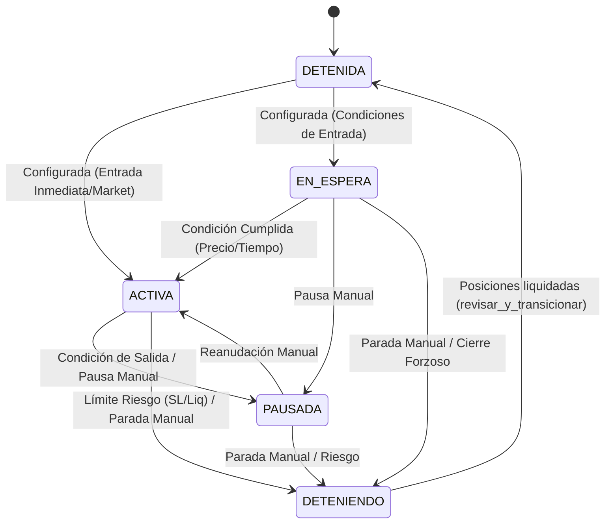

# Máquina de Estados y Gestión del Ciclo de Vida

El **Trading Terminal** opera mediante un riguroso control de estados (State Management) para garantizar la consistencia de los datos entre la memoria del bot y el estado real (físico) en el exchange. Este diseño previene la ejecución de órdenes huérfanas, la duplicación de transacciones y permite una interfaz de usuario (TUI) altamente reactiva.

La gestión de estados se divide en dos niveles de dominio: el nivel de **Operación** (macro) y el nivel de **Posición Lógica** (micro).

---

## 1. Nivel Macro: Ciclo de Vida de la `Operacion`

El objeto `Operacion` (gestionado centralmente por el `OperationManager`) define el estado global de una estrategia direccional (`LONG` o `SHORT`). Es una máquina de estados determinista.

### 1.1. Diagrama de Transición de Estados



### 1.2. Definición de Estados

*   **`DETENIDA` (Stopped):** Estado inactivo y por defecto. No hay capital en riesgo, no se evalúan indicadores técnicos ni se envían órdenes. La operación puede ser configurada de cero.
*   **`EN_ESPERA` (Waiting):** La operación ha sido configurada y fondeada lógicamente, pero está "dormida" esperando que el mercado cumpla una condición de entrada (ej. `Precio > X` o `Temporizador de 15 min`).
*   **`ACTIVA` (Active):** El bot está operando activamente. Escucha las señales del `SignalGenerator`, abre nuevas `LogicalPositions` (respetando el DCA) y actualiza los Trailing Stops continuamente.
*   **`PAUSADA` (Paused):** Estado de interrupción operativa. Las posiciones que ya están `ABIERTAS` siguen siendo monitoreadas (los Stop Loss y Trailing Stops siguen funcionando), pero **no se permite abrir nuevas posiciones**. Se alcanza manualmente o por un Límite de Salida (ej. `Max Trades alcanzados`).
*   **`DETENIENDO` (Stopping):** Estado transitorio crítico (Graceful Shutdown). Se activa ante un *Cierre de Pánico*, una Liquidación o un Stop Loss Global. Bloquea cualquier otra acción, instruye al `PositionExecutor` a lanzar órdenes a mercado para aplanar la posición física, y una vez confirmado el saldo 0, auto-transiciona a `DETENIDA`.

### 1.3. Concurrencia y Thread Safety

Dado que la TUI (Hilo Principal) y el Ticker (Hilo Secundario) interactúan con la FSM simultáneamente, el `OperationManager` protege todas las mutaciones de estado mediante un Mutex Reentrante (`threading.RLock()`).

```python
# Referencia: core/strategy/om/_manager.py
def pausar_operacion(self, side: str, reason: Optional[str] = None, price: Optional[float] = None) -> Tuple[bool, str]:
    with self._lock:  # <- Protección estricta contra Race Conditions
        target_op = self._get_operation_by_side_internal(side)
        if not target_op or target_op.estado not in ['ACTIVA', 'EN_ESPERA']:
            return False, "Error de transición de estado."
        
        target_op.estado = 'PAUSADA'
        # ... actualización de contadores ...
```

---

## 2. Nivel Micro: Ciclo de Vida de la `LogicalPosition`

Mientras la `Operacion` dicta la política general, la `LogicalPosition` dicta el estado del capital fragmentado (DCA). Su ciclo de vida permite el concepto de *Grid Trading* asimétrico.

### 2.1. Estados de Posición

*   **`PENDIENTE` (Pending):** La posición tiene `capital_asignado` pero aún no ha sido inyectada al mercado.
*   **`ABIERTA` (Open):** El `PositionExecutor` ha colocado con éxito la orden en Bybit. La posición ahora tiene un `entry_price` y un `size_contracts` real.
*   **`CERRADA` (Closed):** Estado efímero utilizado principalmente durante cierres forzosos.

### 2.2. Reutilización Dinámica (Reciclaje de Capital)

A diferencia de los bots tradicionales donde un trade cerrado es inmutable, esta arquitectura implementa **Reciclaje de Posiciones Lógicas** para permitir una operatoria ininterrumpida (efecto *Grid*).

Cuando el `PositionManager` cierra exitosamente una posición lógica `ABIERTA` (por ejemplo, porque tocó su Take Profit individual), ocurre lo siguiente:

1. Se calcula el PNL Neto.
2. Las ganancias se envían al `TransferExecutor` (para enviarlas a la subcuenta `profit`).
3. **El objeto `LogicalPosition` no se elimina, sino que se limpia y se reinicia a `PENDIENTE`.**

```python
# Referencia: core/strategy/pm/manager/_private_logic.py -> _close_logical_position
# Tras confirmar el cierre en el exchange:
if pos_to_reset_in_list:
    pos_to_reset_in_list.estado = 'PENDIENTE' # <-- Reciclaje
    pos_to_reset_in_list.entry_timestamp = None
    pos_to_reset_in_list.entry_price = None
    pos_to_reset_in_list.ts_is_active = False
    # ... se limpian el resto de los atributos ...
```

**Ventaja Arquitectónica:** Al volver a `PENDIENTE`, ese "hueco" o lote de capital vuelve a estar disponible para que el bot lo utilice en la próxima señal direccional, permitiendo que la estrategia continúe generando interés compuesto automáticamente sin intervención humana y sin instanciar nuevos objetos en memoria constantemente.

---

## 3. Orquestador de Eventos (EventProcessor)

El motor que empuja esta máquina de estados hacia adelante en el tiempo es el `EventProcessor`. Actúa como un *Cron* impulsado por los eventos de precio (`ticks`).

En cada tick válido, el `EventProcessor` ejecuta un bucle estricto:
1.  Pide al `PM` que revise la API del exchange (`sync_physical_positions`) para confirmar que las posiciones lógicas `ABIERTAS` existen realmente en el exchange.
2.  Llama al `OM` para que evalúe si los límites de tiempo, límites de ROI o Stop Loss globales requieren transicionar el estado macro (ej. de `ACTIVA` a `DETENIENDO`).
3.  Calcula los indicadores matemáticos (`TAManager`) y genera la señal de *underlying trend*.
4.  Si el estado es `ACTIVA`, inyecta la señal en el `PM`, el cual decide si el precio permite transicionar una posición `PENDIENTE` a `ABIERTA` (respetando la distancia del DCA).
